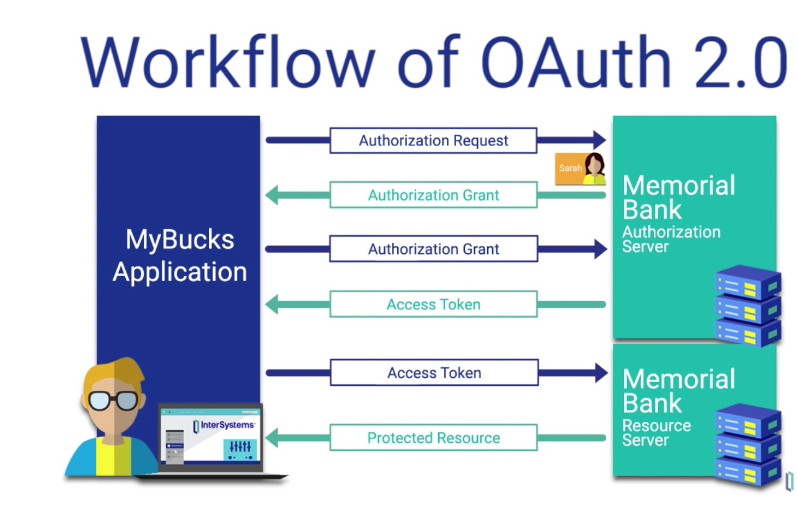
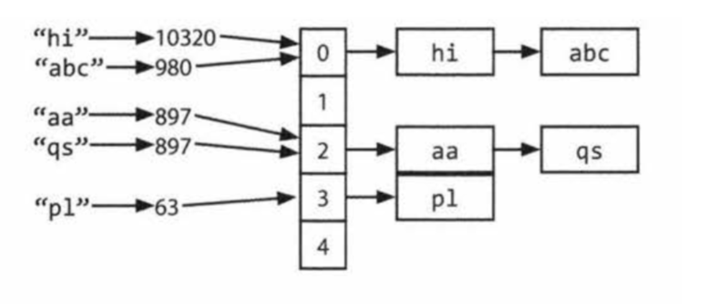
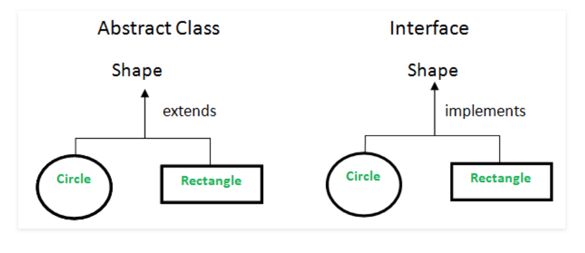
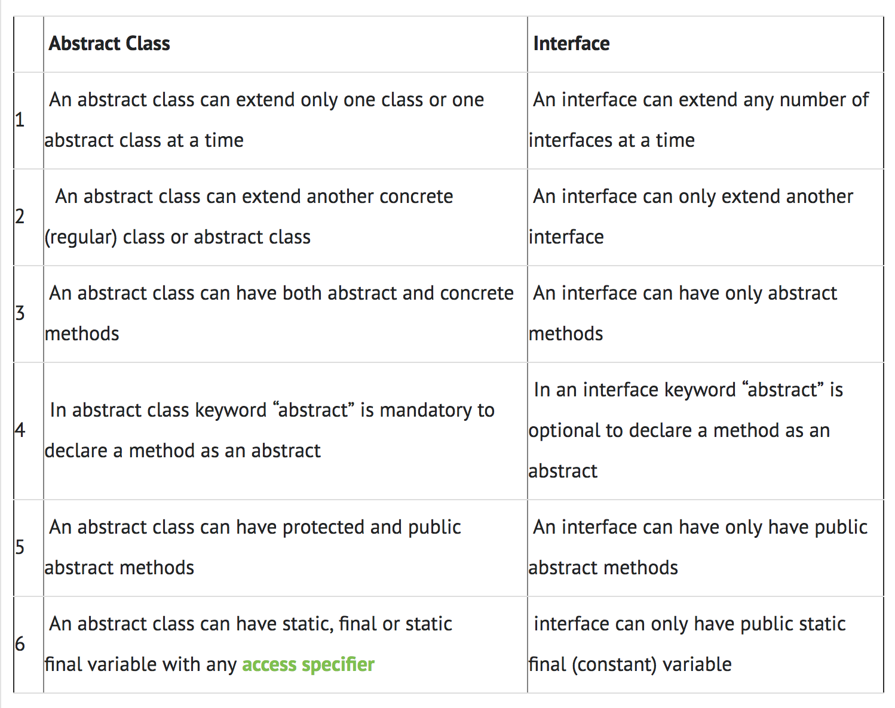

## Interview Questions

##### Question: Can you explain few ways of authenticating your API users

- Authentication: an entity proves an identity
- Authorization: an entity proves right of access
- Ways of Authentication: - Basic: HTTP user agent proves username and password - API Keys: The key is created when a user first authenticate and is used going forward. - OAuth: It is the most secured way to access api. Example of OAuth is the way _Mint_ app connects to different banks to get account summary and transations. Below image shows the steps in the process  

##### How HashSet is implemented in Java

- Internally, Hashset is implemented using Hashmap.
- Each item that needed to be added to the Set, is stored as key in a HashMap. As for the HashMap value, a dummy value is stored called PRESET.

##### How HashMap is implemented in Java

- In java, hashmap is implemented using an Array and LinkedList
- For a given key, it's hashcode is calculated.
- Then hashCode(key) % arrayLength will give array index.
- The value is stored as a linkedlist node at that index.
- If there is a key with the same hashcode then it's value is simply appended to the linkedlist.  

##### Difference between Interface vs Abstract classes?

- Both Interface and Abstract classes are used for abstraction.  
- Abstract Class: When some classes need to share few lines of code, then that code can be in an abstract class and extended by child classes. 
- Interface Class: When we need full abstraction such that each class need to have it's own implementation of a functionality. 
  

##### What benefits do microservices bring in?
- Large application is built as a suite of modular services. 
- Each service meant to be small, independent and scalable unit. 
- Dockers are enablers of microservice architecture.  
Docker containers are designed to be pared down to the minimal viable pieced need to run whatever one thing the container is designed to do.  
Using containers and microservices together enhances cloud capabilities.

##### Disadvantages of microservices
- Developing distributed systems can be complex. 
- Testing microservices based application can be cumbersome.
- Complexity of managing a large number of services. 

##### When you are developing a REST API, what sort of test coverage do you add? Any additional manual QA is required?
- Unit testing and Integration testing by mocking depent services responses. 
- Manual QA will have to do EndToEnd testing when the service is actually connected to other services in real time. 

##### Do you know what SOLID stands for? Which principle is most relevant to you?
- SOLID is acronym for 5 principles
- Single Responsiblity principle
- Open/Closed principle
- Liskov substitution principle
- Intervace segregation principle
- Dependency inversion principle

##### What's a Pure Function?
- It is a function where the return value is determined by it's input values without observable side effects, eg: Math.cos(x) 
- The function becomes impure when the output depends on somthing like global variable.
